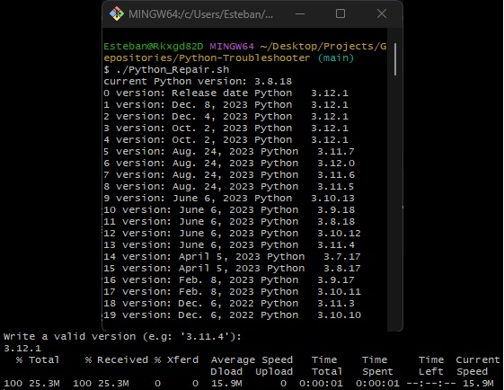
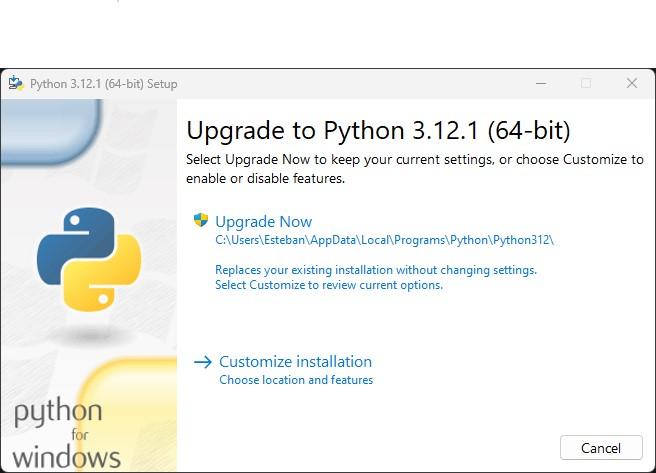

<h1>
<b> Python Migrations </b>
</h1> 

 <i>Business Inquiries:</i> 

  

|                                 | 
Description
                                   |
| ------------------------------------------ | ----------------------------------------                       |
| Ext.:  | [.sh](https://github.com/EstebanMqz/Python-Troubleshooter/blob/main/shell/Python_Repair.sh), [.ipynb](https://github.com/EstebanMqz/Python-Troubleshooter/blob/main/notebook/pkgs.ipynb), [.txt](https://github.com/EstebanMqz/Python-Troubleshooter/blob/main/requirements.txt) |
| Usage: | While most programs in this repo work individually, they ensure remote  collaborations in an environment by selecting a certain Python version for it and its corresponding pkgs versions.    <i> 
 Follow these simple steps in order to solve dependencies incompatibilities, runtime errors & security vulnerabilities in projecta to ensure team's Collaborations by matching requirements & Python version in an environment.
|
| Tags: | [Python](https://www.python.org/), [Shell](https://en.wikipedia.org/wiki/Shell_script), [Environment](https://en.wikipedia.org/wiki/Environment_variable), [Dependencies](https://pypi.org), [Git](https://git-scm.com/) 

---
### Steps:
1\. Clone Repo 

2\. 
Run [pkgs.ipynb](https://github.com/EstebanMqz/Python-Troubleshooter/blob/main/notebook/pkgs.ipynb) (step 1 & 2) to make a list of [requirements.txt](https://github.com/EstebanMqz/Python-Troubleshooter/blob/main/requirements.txt) from your current environment to migrate.  ([pip](https://pip.pypa.io/en/stable/installation/) is used as <a href="#subprocess">`subprocess`</a>).

<section id="subprocess">

Subprocess

- Built-in module that for processes in terminals <i>([cmd](https://learn.microsoft.com/en-us/windows-server/administration/windows-commands/cmd), [bash](https://github.com/EstebanMqz/Git-Basic-Commands), [powershell](https://learn.microsoft.com/en-us/powershell/), etc.) </i> , connects to their [input,output & error pipes](https://docs.python.org/3/library/subprocess.html#subprocess.Popen) while returning their respective [output codes](https://docs.python.org/3/library/subprocess.html#subprocess.CompletedProcess) <i>(0: success, 1: error, 2: warning).</i>
- [`subprocess`](https://docs.python.org/3/library/subprocess.html) is <i>lower-level</i> because of its manual config., but has more control over processes.  

###### See also : &nbsp; 

 

3\. 
Run [Python_Repair.sh](https://github.com/EstebanMqz/Python-Troubleshooter/blob/main/shell/Python_Repair.sh)

 

Output:

  

Select a version for your base or environment.

<i><b>Note:</b> It could be any version for all your team.</i>

 

4\. [.exe](https://github.com/EstebanMqz/Python-Troubleshooter/blob/main/python-3.12.0-amd64.exe) should be downloaded in [pwd](https://en.wikipedia.org/wiki/Pwd), execute it. 

Output:

 

5\.  Run [pkgs.ipynb](https://github.com/EstebanMqz/Python-Troubleshooter/blob/main/pkgs.ipynb) (step 3) to upgrade pip and to implement an [`upgrade strategy`](https://pip.pypa.io/en/stable/cli/pip_install/#cmdoption-upgrade-strategy)

- [`only-if-needed`](https://pip.pypa.io/en/stable/cli/pip_install/#cmdoption-upgrade-strategy): Only upgrade the packages that are needed to satisfy the requirements.
- [`eager`](https://pip.pypa.io/en/stable/cli/pip_install/#cmdoption-upgrade-strategy): Upgrade all packages regardless of whether they are needed to satisfy the requirements.)

<h4>References</h4>

  
  
  
  

